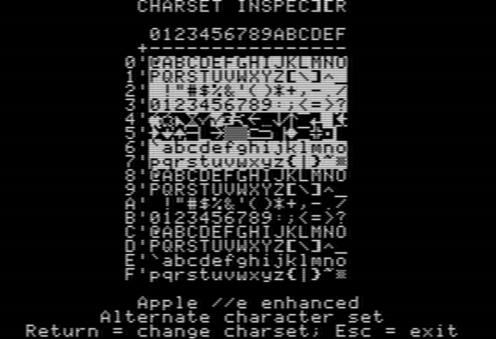

<!--
SPDX-FileCopyrightText: © 2026 Ryan Carsten Schmidt <https://github.com/ryandesign>
SPDX-License-Identifier: MIT
-->



Charset Inspector is an Apple II program written in 6502 assembly that displays
a single screen showing all the characters in the character set. On the Apple
//e and later and on the Apple ][ J-plus, the alternate character set can also
be displayed.

## Compatibility

Charset Inspector should work with any Apple II.

## Building

To build Charset Inspector, install [cc65](https://github.com/cc65/cc65) and
run:

```
make
```

To make a disk image that can be loaded into an emulator or transferred to a
real floppy disk using [adtpro](https://github.com/ADTPro/adtpro), install
[c2d](https://github.com/datajerk/c2d) and run:

```
make dsk
```

To make an audio file that can be played into a real Apple II, install
[c2t](https://github.com/datajerk/c2t) and run:

```
make aif
```

To play that audio file into a real Apple II on macOS, connect an audio cable
between your Mac's audio out port and the cassette in port of an Apple ][ plus,
Apple //e, enhanced Apple //e, or platinum Apple IIe, and on the Apple II run:

```
LOAD
```

and on the Mac run:

```
make play
```

## License

Charset Inspector is released under the MIT license.
